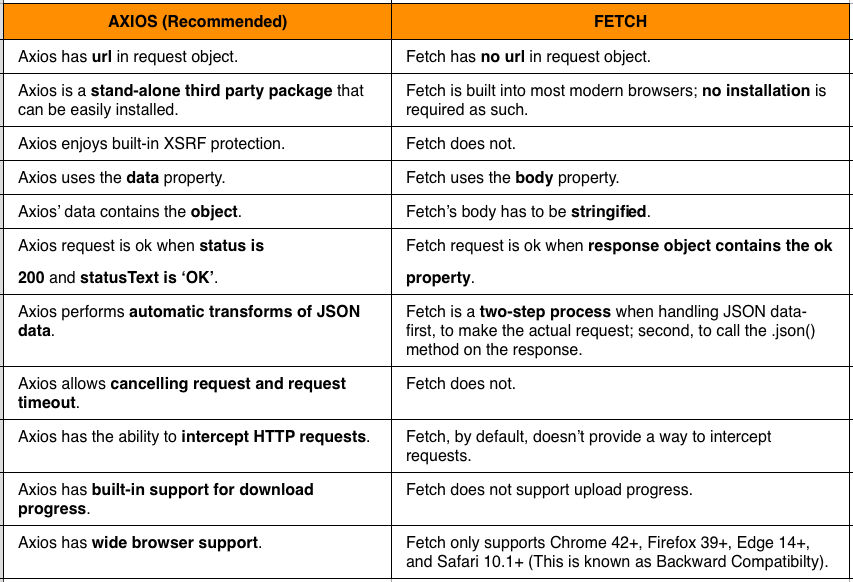

  What is Virtual DOM ?
  Ans-The Virtual DOM (VDOM) is an in-memory representation of Real DOM. The representation of a UI is kept in memory and synced with the "real" DOM. It's a step that happens between the render function being called and the displaying of elements on the screen. This entire process is called reconciliation. (or) DOM is a document object model, created by converting HTML CSS and JS Real DOM, which is an object which gets created whenever any React application gets loaded on the screen for the first time., whenever React components gets mounted on the screen for the first time. Now when any user makes any changes on the screen like button click because of which the state variable will get updated so in this case the changes will not directly go to Real DOM , instead in react we have concept known Virtual DOM. So we are having two virtual doms, one virtual dom gets created at the time of mounting of react component so it is a copy of your real dom. Another virtual dom is the dom which contains the new changes, updated state variables values. Now these two virtual doms will get compared with each other and will check for the new changes. this complete procedure is known as diffing algorithm. Now the new changes will be updated in your Real dom. this procedure is known as Recoinciliation.
 

What is SPA?
Single page application : Any web application , in which when you are clicking on any button or selecting option from navigation bar then if your page which means browser page is reloading then that means that application is your multi - page application . If it does not reload the browser page and just only updates the page without reloading then that application is known as Single Page application. When you create React application using CRA, (create-react-app boilerplate , developed by Facebook) it always create the application which will be Single page application.

3. What is difference between Functional and Class component?
Functional Components::
  a.A functional component is just a plain JavaScript function that accepts props as an argument and returns a React element.
  b.There is no render method used in functional components.
 c.Also known as Stateless components as they simply accept data and display them in some form, that they are mainly responsible for rendering UI.
 d.React lifecycle methods (for example, componentDidMount) cannot be used in functional components.
 e.Hooks can be easily used in functional components to make them Stateful. example: const [name,SetName]= React.useState(" ")
 f.Constructors are not used.

Class Component::
a .A class component requires you to extend from React. Component and create a render function which returns a React element.
b.It must have the render() method returning JSX (which is syntactically similar to HTML)
c.Also known as Stateful components because they implement logic and state.
d.React lifecycle methods can be used inside class components (for example componentDidMount).
e.It requires different syntax inside a class component to implement hooks. example: constructor(props) { super(props); this.state = {name: ‘ ‘} }
f.Constructor are used as it needs to store state.

4. What does mean by state and its use in react?
Ans-State of a component is an object that holds some information that may change over the lifetime of the component. We should always try to make our state as simple as possible and minimize the number of stateful components.
Code-
class User extends React.Component {
    constructor(props) {
      super(props)

      this.state = {
        message: 'Welcome to React world'
      }
    }

    render() {
      return (
        

          <h1>{this.state.message}</h1>
        

      )
    }
  }

  State is similar to props, but it is private and fully controlled by the component ,i.e., it is not accessible to any other component till the owner component decides to pass it.

  5. What is JSX and why do we use it instead of js?
  Ans- JS is simply a scripting language, adding functionality into your website. JSX is an addition to the JavaScript syntax which is a mixture of both HTML and JavaScript. Both JS and JSX are interchangeable but JSX makes the code easier to understand for users.
JSX or JavaScript XML combines HTML and JavaScript, making the code easier to read and understandable for the user. JSX combines interactivity with markup rather than separating the two. It makes it easier to visualize DOM. In JSX we can directly write HTML tags inside JavaScript code. One of the advantages of JSX is that React creates a virtual DOM (a virtual representation of the page) to track changes and updates. Instead of rewriting the entire HTML, React modifies the DOM of the page whenever the information is updated. This is one of the main issues React was created to solve.

6.What is package.json?
Ans-Package.json contain all the library which we are using in developing that particular project and the library which we have installed to use in json formate.

7.What is the Difference between react and react native? Which one is library or framework?
Ans- ReactJs is mainly called raect,which is a javascript library whereas raect native is a framework of React.js dessigned for developing web app. 
  Both React and react native is developed by facebook and gained a huge fanbase in market.
  React is an open-source JS library for building the UIs for web applications; besides, React Native is used to build rich mobile UI from declarative components using only JavaScript. Both React and React Native are ruling the industry and are widely used for mobile and web applications. However, the difference between web apps vs websites will not affect your user.

8. What is the package name you are using for routing.
Ans- The package which we are using for routing is React Router .
    In this we have firstly BrowserReact, inside the BrowserReact we have a Routes and inside the Routes we have many Route according to our use.In route we define the path which we simply use in navigation bar.React Router is helping us to make a SPA (Single Page Application) in which we simply click a button to ho ahead in a particular component without refereshing the page -and this is the use of react Roter Dom.
9.Routing Implementation.
Ans- In Routing Implementation we definetly have two or more than two component.letus see the implementation.
 Home page-
 import React from "raect";
 const Home =()=>{
  return(<>
  <h1> this is home page.
  </h1>)
 }
 export default Home;

 About page-
 import React from "raect";
 const About =()=>{
  return(<>
  <h1> this is About page.
  </h1>)
 }
 export default About;;

 Not Found Page-
 import React from "raect";
 const NotFound =()=>{
  return(<>
  <h1> this is NotFound page.
  </h1>)
 }
 export default NotFound;

 In App.js
 import {BrouseRouter,Routes,Route} from "react-router-dom"
 import Home from "./home";
 import About from "./about";
 import NotFound from "./notfound";

 in return 
 <BrouseRouter>
 <Routes>
 <Route path="/" element = {<Home/>}/>
 <Route path="/about" element={<About/>}/> 
 </Routes>
 </BrouseRouter>

in Navigation component;
import {Link} from "react-router-dom";
const Navigation =()=>{
  return(<>
  <Link to ="./" >Home<Link>
  </Link>)
};

10.How do you pass data from parent to child?
We can pass data from parents to child using props.
implementation.
let  I have created a component naming as Folder

import React from "react";
const Folder =(props)=>{
  return(<>
  <h1> my name is ravi
  yes my name is {prop.name}
  </h1>)
}
export default Folder;

in App.js
import Folder from "./folder";
<Folder name={ravi}/>

11.What is lazy loading in react ?
In essence, lazy loading means that a component or a part of code must get loaded when it is required. It is also referred to as code splitting and data fetching . Talking about React specifically, it bundles the complete code and deploys all of it at the same time.

Example:An example of image lazy-loading can be found on the popular publishing platform Medium, which loads lightweight placeholder images at page load, and replaces them with lazily-loaded images as they're scrolled into the viewport. An example of image lazy-loading in action.

For example, let's consider that our application has two sections, A and B. Size of A is 1 MB and its loading time is approximately 1 second. Size of B is also 1 MB and so its loading time is also 1 second. And we know that a user will access either of the sections, or a user accessing section A will rarely access section B and vice versa. If we were to load the complete application at the starting of our application, it would cost the user 2 MB of data and the loading time will also be 2 seconds. The user might not like to wait for 2 seconds or won't be happy that a site is costing them a lot of data. This can be improved and halved with proper lazy loading.

12. Difference b/w Stateful and stateless Component.
Ans- Stateless components
 If the behaviour is independent of its state then it can be a stateless component. You can use either a function or a class for creating stateless components. But unless we need to use a lifecycle hook in your components, we should go for function components. There are a lot of benefits if you decide to use function components here; they are easy to write, understand, and test, a little faster, and you can avoid the this keyword altogether.
   Statefull Components
   If the behaviour of a component is dependent on the state of the component then it can be termed as stateful component. These stateful components are always class components and have a state that gets initialized in the constructor. class App extends Component { constructor(props) { super(props) this.state = { count: 0 } }

   Class components is bydefault a statefull component whereas we need to add a hooks in functional components called setState to make it Statefull components.

13.How do you switch one component to another, Conditional Rendering.
Ans-
Way to Switch/Navigate from one page to another page

1.Link

2.NavLink(Using Recat Roter Dom)

Link Link is used to manage the navigation and it worked as an anchor tag. Check below code for the demonstration. import { Link } from 'react-router-dom'; ... ...

About
NavLink NavLink behaves the same as Link but in addition, it comes with a new attribute called “activeClassName” which helps us to add the class to the anchor tag when page url will match.

import { NavLink } from 'react-router-dom'; ... ... About   

14.Difference between Axios and fetch?
Ans-Axios is a Javascript library used to make HTTP requests from node.js or XMLHttpRequests from the browser and it supports the Promise API that is native to JS ES6. It can be used intercept HTTP requests and responses and enables client-side protection against XSRF. It also has the ability to cancel requests. EX:: axios.get('url') .then((response) => {
  Fetch:
  The Fetch API provides a fetch() method defined on the window object. It also provides a JavaScript interface for accessing and manipulating parts of the HTTP pipeline (requests and responses). The fetch method has one mandatory argument- the URL of the resource to be fetched. This method returns a Promise that can be used to retrieve the response of the request. EX:: fetch('path-to-the-resource-to-be-fetched') .then((response) => {
   
   Axios        

15.What is UseState Hook ?(Implementation)?
Ans- we can use UseState hook in a counter component like
    import React,{useState} from "react";
const UseStatee =()=>{
   const[number,SetNumber]=useState(0)
    <!-- return(

      <h1>hello developers</h1>
      <h2>now the count in {number}</h2>
      <button onClick={()=>SetNumber(number+1)}>click here</button>
    
)
} -->
export default UseStatee;
you can component1 page -useStatee component for  useStatehooks.

16.What is useEffect Hook ?(Implementation).
 As we know useEffect is used for stoping the extra rerendering process in a components.
 <!-- import React,{useState ,useEffect} from "react";
const UseStatee =()=>{
   const[number,SetNumber]=useState(0);
//    const[count,SetCount]=useState(5);
   useEffect(()=>{
    // function ravii(){
     
        console.log("rendering again and again")
    //    }
   },[]);
   
    return(

      <h1>hello developers</h1>
      <h2>now the count in {number}</h2>
      {/* <h2>{ravii}</h2> */}
      <button onClick={()=>SetNumber(number+1)}>click here</button>
    
)
}
export default UseStatee; -->

refer-components1/useStatee.jsx for code implementation.

17.What are React Life cycles Explain each one with Example?
Every component have a lifecycle in react which we can divide in three stage-
MOunting,UpDate,Unmount
birth, growth ,death
Methods in lifecycle
> render()
> componentDidMount()
> componentDidUpdate()
> componentWillUnmount()
<!-- 
import React from "react";
import Navbar from "./Navbar";
class LifeCycle extends React.Component{
    constructor(){
        super()
        this.state={
            show:true,
        counter:0
        }
        console.log("constructor");
    }
    componentDidMount(){
        console.log("component did mount");
    }
    componentDidUpdate(pP,pS,sS){
        console.log("component is updated", pS)
       
    }
     
    render(){
        console.log("render");
        return(

            <h1>hello developers</h1>
           { this.state.show ?
           <Navbar />:null
           }
          
           <button onClick={()=>{this.setState({show:!this.state.show})}}>toggle button</button>
           <h2>{this.state.counter}</h2>
           <button onClick={()=>{this.setState({counter:this.state.counter+1})}}>Update counter</button>
        
)
    }
}

export default LifeCycle; -->
refer-component1/lifeCycle.jsx

18.What is UseReducer Hook ?(Implementation)
UseReducer is similar to useState but when we need to perform more operations that time we can use switch and case in useReducer.It will be little easy for us while we are writting big code.
<!-- import React,{useReducer} from "react";

const Reducerr =()=>{
const initialState = 0;
    function reducer(state,action){
      switch(action){
        case "add":
            return state +1;
        case "substract":
            return state-1;
        case "reset":
            return 0;
            default :  return state        
      }

    } ;
   const[count,dispatch] = useReducer(reducer,initialState);
    return(

        <h1>hello web developers.</h1>
        <h2>{count}</h2>
        <button onClick={()=>dispatch("add")}>Add</button>
        <button onClick={()=>dispatch("reset")}>Reset</button>
        <button onClick={()=>dispatch("substract")}>Substract</button>
    
)
}
export default Reducerr; -->

19. What is UseMemo Hook ?(Implementation)
  The useMemo Hook only runs when one of its dependencies update. This can improve performance. The useMemo and useCallback Hooks are similar.
  <!-- import React,{useState,useMemo} from "react";

const Numbers = ()=>{
   const[inc,SetInc]= useState(0);
   const[dec,SetDec]=useState(100);
   const UseMemoMultiplication = useMemo(
    function Multiply (){
        console.log("function is rendered")
        return inc*10;
       },[inc]);
   

   return(

    <h1>Increased number is {inc}</h1>
    <h1>Decreased number is {dec}</h1>
    <h2>multiplication no is {UseMemoMultiplication}</h2>
   <button onClick={()=>SetInc(inc+1)}>increase</button>
   <button onClick={()=>SetDec(dec-1)}>decrease</button>
   
)
};

export default Numbers; -->
refer-component1-useMemoo

20.What is Context api?
Ans-The Context API is a React structure that enables you to exchange unique details and assists in solving prop-drilling from all levels of your application. (or) Context provides a way to pass data through the component tree without having to pass props down manually at every level.

For example, authenticated users, locale preferences, UI themes need to be accessed in the application by many components.

const {Provider, Consumer} = React.createContext(defaultValue)

21.Difference between callback and useCallback Hook ?
Ans- callback is used for passing a object or argument to a function where as usecallback is a hook ,in this we can pass a function to the another function.
The callback function is invoked when setState finished and the component gets rendered. Since setState() is asynchronous the callback function is used for any post action. Note: It is recommended to use lifecycle method rather than this callback function.

22.What is Props Drilling Concept ?What is State Uplifting ?
Ans-Prop Drilling :
It is the process by which you pass data from one component of the React Component tree to another by going through other components that do not need the data but only help in passing it around.

State Uplifting:
When several components need to share the same changing data then it is recommended to lift the shared state up to their closest common ancestor. That means if two child components share the same data from its parent, then move the state to parent instead of maintaining local state in both of the child components.

23.Difference between useEffect and useContext ?
Ans- useEffect :
It allows us to implement all of the lifecycle hooks from within a single function API. // this will run when the component mounts and anytime the stateful data changes React.useEffect(() => { alert('Hey, Nads here!'); });

// this will run, when the component is first initialized React.useEffect(() => { alert('Hey, Nads here!'); }, []);

// this will run only when count state changes React.useEffect(() => { fetch('nads').then(() => setLoaded(true)); }, [count]);

// this will run when the component is destroyed or before the component is removed from UI. React.useEffect(() => { alert('Hey, Nads here'); return () => alert('Goodbye Component'); });
useContext :
This hook allows us to work with React's Context API, which itself a mechanism to allow us to share data within it's component tree without passing through props. It basically removes prop-drilling const ans = { right:right, wrong:wrong  }

